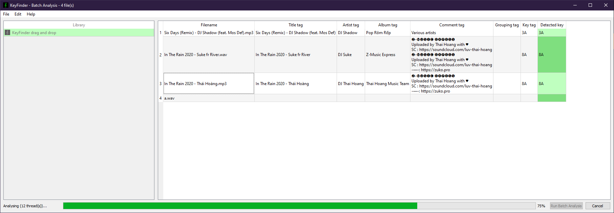
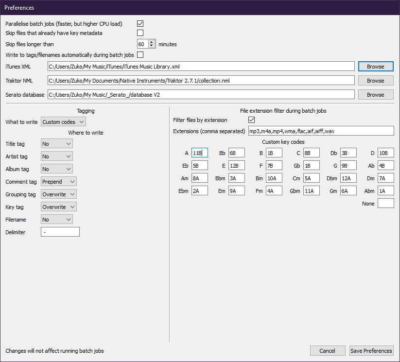

# KeyFinder

KeyFinder is a tool for estimating the musical key of digital recordings, to aid
DJs in harmonic mixing. It decodes audio, runs the key-detection DSP from
[libkeyfinder](https://github.com/mixxxdj/libkeyfinder), and writes the result
back to file tags, filenames, and DJ-software libraries (iTunes, Traktor,
Serato).

This repository (`is_KeyFinder`) is the **Qt/C++ desktop GUI application**; the
`is_` prefix (the original author's initials) distinguishes it from the
`libkeyfinder` library it depends on.

## Screenshots (v2.4)

Batch analysis — drag in a folder or files and detect keys in bulk, then write
them to tags/filenames:



Preferences — notation/custom key codes, which tag fields to write, DJ library
paths, and analysis options:



## Download

Head to [Release](../../releases)

## CLI mode

A primitive CLI (bypasses the GUI) is triggered when more than two arguments are
passed:

```bash
KeyFinder -f /path/to/track.mp3        # print detected key code to stdout
KeyFinder -f /path/to/track.mp3 -w     # also write the key to file tags
```

## Credits & licence

KeyFinder began as Ibrahim Sha'ath's MSc final project at Birkbeck, University of
London; the project report documenting the algorithms and the original binaries
are at <https://www.ibrahimshaath.co.uk/keyfinder>.

Localisations are hosted on
[Transifex](https://www.transifex.com/projects/p/is_keyfinder/).

Licensed under the GNU General Public License v3. Copyright 2011-2013
Ibrahim Sha'ath.
